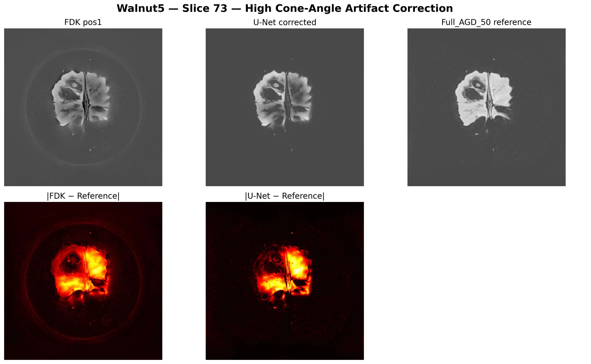
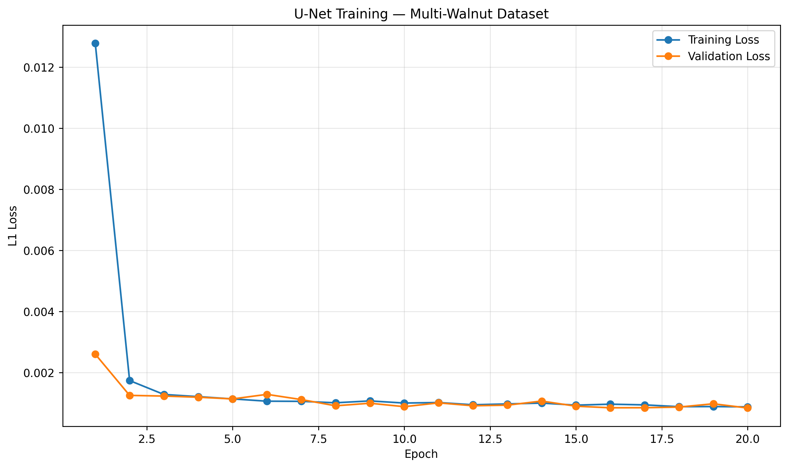
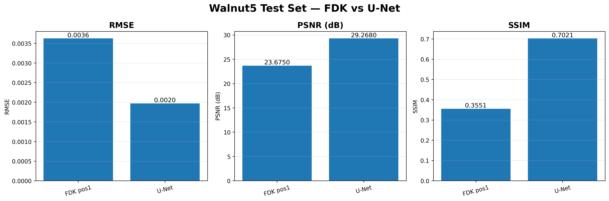

# CBCT High Cone-Angle Artifact Removal Using U-Net

Deep learning-based correction of high cone-angle artifacts in cone-beam computed tomography (CBCT) using a 2D U-Net.

## Overview

Cone-beam CT reconstructions can contain significant artifacts when the cone angle is large, particularly when reconstruction is performed from a single source-detector orbit.

This project investigates whether a convolutional neural network can learn to correct these artifacts directly from reconstructed CBCT slices.

A 2D U-Net is trained to transform a single-orbit FDK reconstruction into a reconstruction that approximates a high-quality reference reconstruction generated using all available acquisition orbits.

### Task

```text
Single-orbit FDK reconstruction
            │
            ▼
       ┌─────────┐
       │  U-Net  │
       └─────────┘
            │
            ▼
Artifact-corrected reconstruction
            │
            ▼
      Full_AGD_50 reference
```

The initial experiment uses the `pos1` acquisition orbit:

```text
Input:  fdk_pos1
Target: full_AGD_50
```

---

## Dataset

The project uses the **CWI/Zenodo Walnut CBCT dataset**, which contains high-resolution cone-beam CT data acquired using three circular source-detector orbits.

The dataset contains:

- 42 walnut specimens
- 3 source-detector orbits
- 1201 projections per orbit
- 768 × 972 detector pixels after 2×2 binning
- approximately 149.6 µm detector pixel size
- high-quality reference reconstructions
- FDK reconstructions for individual acquisition orbits

The original dataset and reconstruction code are available from:

- [CWI Walnut Reconstruction Codes](https://github.com/cicwi/WalnutReconstructionCodes)
- [Walnut CBCT Dataset on Zenodo](https://zenodo.org/record/2686724)

### Reconstruction types

For each walnut, the experiment uses:

```text
fdk_pos1_*.tiff
fdk_pos2_*.tiff
fdk_pos3_*.tiff
full_AGD_50_*.tiff
```

`fdk_pos1`, `fdk_pos2`, and `fdk_pos3` represent different source-detector orbit positions. They are **not spatial X/Y/Z axes**.

`full_AGD_50` is used as the reference target.

---

## Experimental Setup

The first experiment focuses on one acquisition orbit.

### Input

```text
fdk_pos1
```

### Target

```text
full_AGD_50
```

### Model

A 2D U-Net operating independently on individual reconstructed slices.

Architecture:

```text
Input
  │
  ├── Encoder 1: 1 → 32
  │
  ├── Encoder 2: 32 → 64
  │
  ├── Encoder 3: 64 → 128
  │
  ├── Bottleneck: 128 → 256
  │
  ├── Decoder 3: 256 → 128
  │
  ├── Decoder 2: 128 → 64
  │
  ├── Decoder 1: 64 → 32
  │
  └── Output: 32 → 1
```

The network uses:

- 3×3 convolution layers
- ReLU activations
- max pooling
- transposed convolutions
- skip connections
- bilinear interpolation for spatial alignment

---

## Data Split

To avoid leakage between training and testing, entire walnut specimens were assigned to each split rather than randomly splitting individual slices.

| Split | Walnuts | Slices |
|---|---|---:|
| Training | Walnut1–3 | 1503 |
| Validation | Walnut4 | 501 |
| Test | Walnut5 | 501 |

This means that **Walnut5 was completely unseen during training**.

---

## Training

The model was trained using:

| Parameter | Value |
|---|---|
| Model | 2D U-Net |
| Input | Single-channel FDK slice |
| Target | `full_AGD_50` |
| Loss | L1 loss |
| Optimizer | Adam |
| Learning rate | 1 × 10⁻⁴ |
| Epochs | 20 |
| Training walnuts | 1–3 |
| Validation walnut | 4 |
| Test walnut | 5 |

The best checkpoint was selected using validation L1 loss.

Best validation loss:

```text
0.000833
```

at epoch 20.

---

## Results

Evaluation was performed on the **501 slices of the completely unseen Walnut5 test volume**.

Metrics below are the mean of the per-slice measurements.

| Metric | Single-orbit FDK | U-Net |
|---|---:|---:|
| RMSE ↓ | 0.003623 | **0.001969** |
| PSNR ↑ | 23.675 dB | **29.268 dB** |
| SSIM ↑ | 0.3551 | **0.7021** |

The U-Net produced a:

```text
45.67% reduction in mean per-slice RMSE
```

relative to the single-orbit FDK baseline.

PSNR increased by approximately:

```text
+5.59 dB
```

while SSIM increased from:

```text
0.3551 → 0.7021
```

These results indicate that the trained network learned to reduce reconstruction differences relative to the `full_AGD_50` reference on the unseen Walnut5 volume.

---

## Qualitative Results

Example from **Walnut5, slice 73**:

```text
FDK pos1
     ↓
U-Net corrected
     ↓
Full_AGD_50 reference
```

The corresponding absolute error maps are also shown to visualize the spatial distribution of reconstruction errors.



For this particular slice, the RMSE values were:

| Reconstruction | RMSE |
|---|---:|
| FDK pos1 | 0.009284 |
| U-Net | 0.008955 |

The single slice is provided as a qualitative example; the aggregate 501-slice test metrics above are the primary quantitative evaluation.

---

## Training Curve

The training and validation L1 losses over 20 epochs are shown below.



The validation loss decreased from:

```text
0.002598
```

at epoch 1 to:

```text
0.000833
```

at epoch 20.

---

## Quantitative Comparison



The evaluation compares the original single-orbit FDK reconstruction with the U-Net output using RMSE, PSNR, and SSIM.

---

## Project Structure

```text
CBCT-Cone-Angle-Artifact-Removal/
│
├── notebooks/
│   └── CBCT_Artifact_Removal.ipynb
│
├── python/
│   ├── dataset.py
│   ├── model.py
│   ├── train.py
│   └── evaluate.py
│
├── models/
│   └── best_unet_pos1_multiwalnut.pth
│
├── results/
│   ├── training_curve_pos1_multiwalnut.png
│   ├── walnut5_slice073_qualitative_comparison.png
│   └── walnut5_fdk_vs_unet_metrics.png
│
├── cpp/
│   ├── CMakeLists.txt
│   ├── inference.cpp
│   └── README.md
│
├── examples/
│   ├── input/
│   └── output/
│
├── requirements.txt
└── README.md
```

The exact repository contents may evolve as the C++ inference component and additional experiments are added.

---

## Reproducing the Experiment

### 1. Install dependencies

```bash
pip install torch torchvision tifffile numpy scikit-image matplotlib
```

### 2. Download the dataset

Download the required Walnut CBCT data from the original dataset source.

Because the complete dataset is very large, the raw CBCT data is **not included in this repository**.

### 3. Prepare the data

Organize the reconstructed TIFF slices as:

```text
WalnutsOwnReconstructions/
│
├── walnut1/
│   ├── fdk_pos1_000000.tiff
│   ├── ...
│   └── full_AGD_50_000500.tiff
│
├── walnut2/
├── walnut3/
├── walnut4/
└── walnut5/
```

### 4. Train

```bash
python python/train.py
```

The training script saves the best model based on validation loss.

### 5. Evaluate

```bash
python python/evaluate.py
```

Evaluation produces RMSE, PSNR, and SSIM measurements on the unseen test walnut.

---

## Model Checkpoint

The trained model is saved as:

```text
best_unet_pos1_multiwalnut.pth
```

The checkpoint contains the trained PyTorch model parameters.

For deployment outside Python, the model will be exported to a C++-compatible format.

---

## C++ Deployment

A future component of this project is a C++ inference application using the trained network.

The intended workflow is:

```text
PyTorch training
      │
      ▼
best_unet_pos1_multiwalnut.pth
      │
      ▼
Model export
      │
      ▼
C++ / LibTorch inference
      │
      ▼
Corrected TIFF reconstruction
```

Example intended command:

```bash
./cbct_correct \
    --model best_unet_pos1.pt \
    --input walnut15/fdk_pos1_000250.tiff \
    --output walnut15/corrected_000250.tiff
```

This will allow the trained model to be used independently of the Python training environment.

---

## Future Work

Several extensions are planned.

### 1. Additional acquisition orbits

Train independent models for:

```text
fdk_pos1 → full_AGD_50
fdk_pos2 → full_AGD_50
fdk_pos3 → full_AGD_50
```

### 2. Multi-orbit U-Net

Use all three FDK reconstructions as a multi-channel input:

```text
        ┌──────────┐
pos1 ──►│          │
pos2 ──►│  U-Net   │──► full_AGD_50
pos3 ──►│          │
        └──────────┘
```

This allows the network to exploit complementary information from the three acquisition orbits.

### 3. Improved normalization and training

The next controlled experiment will investigate dataset-level normalization based only on training data, along with additional training and validation analysis.

### 4. Generalization

Evaluate the trained model on additional walnuts that were not used during training or validation.

### 5. C++ inference

Export the trained network and implement an end-to-end C++ inference pipeline for reconstructed CBCT slices.

---

## Limitations

This initial experiment has several limitations:

- The current model is a 2D slice-based network.
- The first experiment uses only the `pos1` reconstruction.
- The model was trained and evaluated using a single reference reconstruction type.
- The reported test set contains one completely held-out walnut.
- The current experiment does not yet evaluate the multi-orbit input configuration.
- Further validation on additional unseen walnuts is required to assess generalization.

Therefore, the current results should be interpreted as a **proof-of-concept experiment**, rather than a final clinical or production reconstruction method.

---

## Technologies

- Python
- PyTorch
- NumPy
- scikit-image
- tifffile
- Matplotlib
- Google Colab
- CUDA / NVIDIA GPU for training
- C++ / LibTorch planned for deployment

---

## Acknowledgements

This project uses the Walnut CBCT dataset and reconstruction resources developed by the Center for Computational Imaging and Simulation Technologies (CWI) and collaborators.

Original reconstruction resources:

https://github.com/cicwi/WalnutReconstructionCodes

Dataset:

https://zenodo.org/record/2686724

Please refer to the original dataset publication and repository for the appropriate scientific citation and licensing information.

---

## License

This repository contains code developed for research and educational purposes.

The dataset is subject to the license and usage conditions of its original provider. Please consult the original dataset source before redistributing any data.

---

## Status

**Current status: Proof-of-concept completed**

```text
✓ Dataset preparation
✓ Walnut-level train/validation/test split
✓ Single-orbit FDK → U-Net training
✓ Best-model checkpoint
✓ Unseen Walnut5 evaluation
✓ RMSE / PSNR / SSIM evaluation
✓ Qualitative comparison
✓ Error-map visualization
✓ Training-curve visualization

→ Multi-orbit experiments
→ Additional generalization testing
→ Model export
→ C++ inference
```
